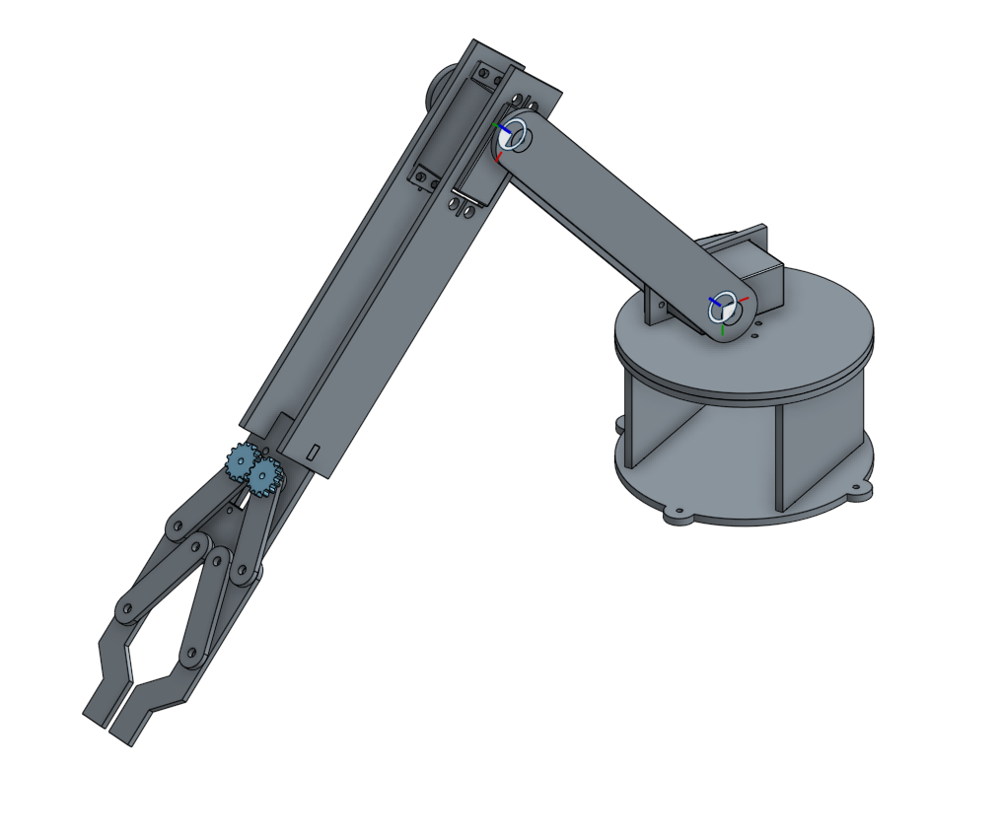

# robot arm
Project 1 for the San Francisco Robot Makers Club.

## Why?
As part of our class we'll be doing simple projects to learn about different aspects of robotics.  Designing the mechanical portion of a robot can be very difficult for software heavy engineers.  The goal of this project is to create a simple project that introduces basic concepts and is still ultimately useful.

## How?
We will be designing a robot arm that can be laser cut from plywood or acrylic.  Using CAD software such as onshape (www.onshape.com) we will design the components of the arm.

## Where?
You can find the current iteration of the project here:

https://cad.onshape.com/documents/8cfdedb2d22c1bee4506a19b/w/bfc8baff98cf54a6a426b8f1/e/78da12b31b874246056a9df1
